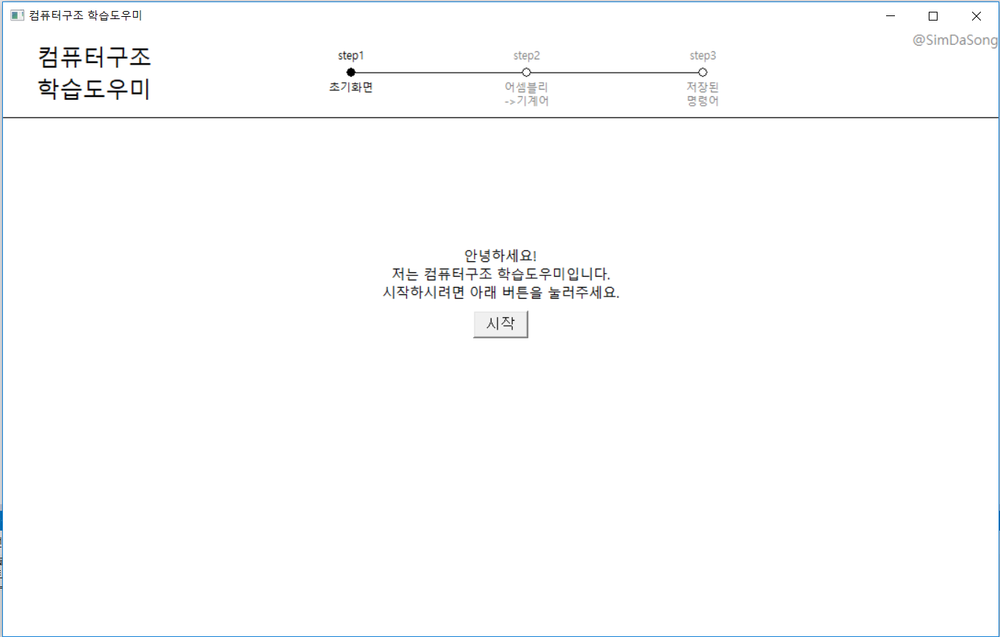
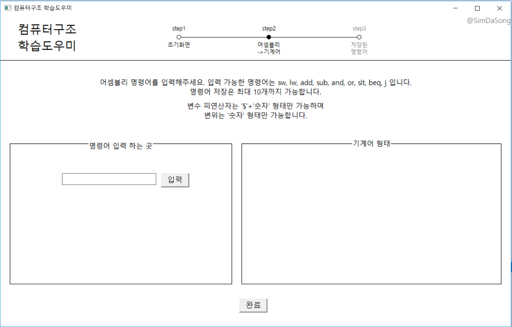
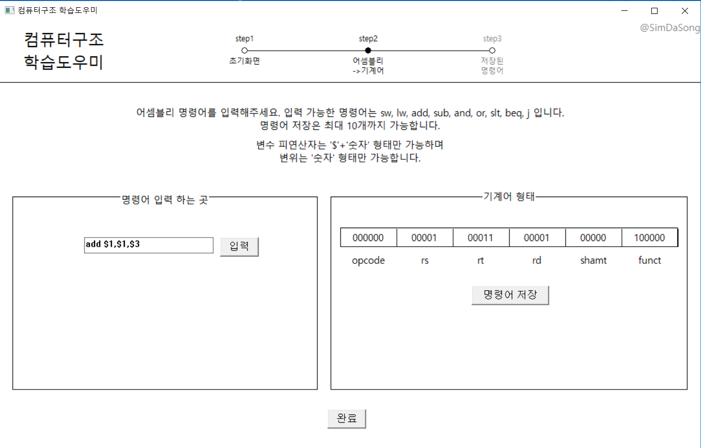
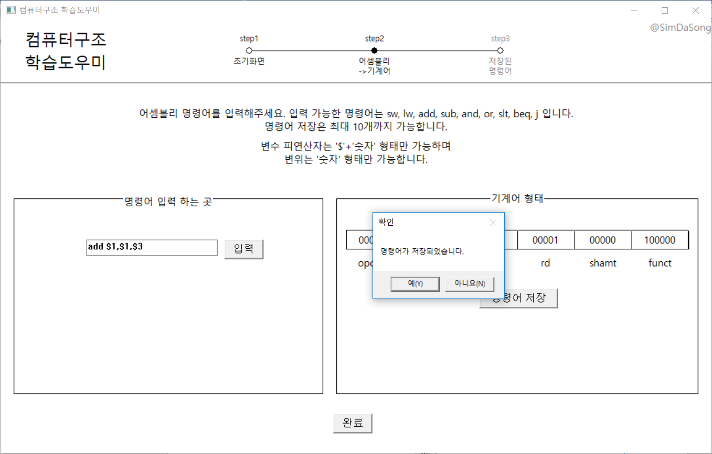
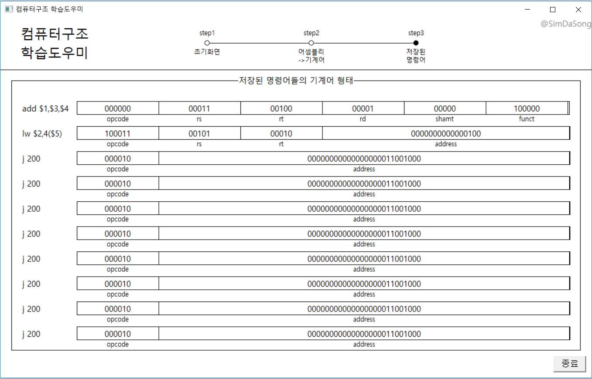

# computer-architecture-helper

> window 창으로 컴퓨터 구조 학습을 할 수 있는 **컴퓨터 구조 학습 도우미** 프로그램 입니다.

## Project Stack

* C++
* Win32 API

## Project Description

### 프로그램 실행 단계
```
A. 시작 버튼을 누르면 어셈블리 명령어를 입력할 수 있는 화면으로 넘어감
B. 어셈블리 언어로 된 명령어를 edit control에 입력 받음
C. 입력 받은 명령어는 바로 기계어 형태로 보여주고, 해당 명령어를 저장할 수 있음. 
D. 명령어 저장은 최대 10개까지 가능. 10개 넘으면 경고 메시지 뜸
E. 입력 받은 명령어가 명령어 형식에 맞지 않다 => 경고 메시지 뜸
F. 완료 버튼을 누르면 다음 화면으로 넘어감
G. 이때, 콤보 박스 리스트에 있는 명령어들을 instructions 배열에 저장
H. 입력한 명령어가 없다면 경고 메시지 뜸
I. 다음 화면에서 저장된 명령어들을 기계어로 변환하여 화면에 출력
```

### 프로그램 실행 화면

</img>
</img>
</img>
</img>
</img>

이외 사항들은 [프로젝트_보고서.pdf][보고서link] 파일과 [프로젝트_ppt.pdf][pptlink] 파일을 통해 확인 하실 수 있습니다.

[보고서link]: 프로젝트_보고서.pdf
[pptlink]: 프로젝트_ppt.pdf